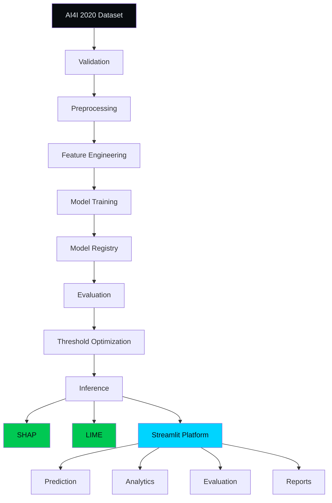
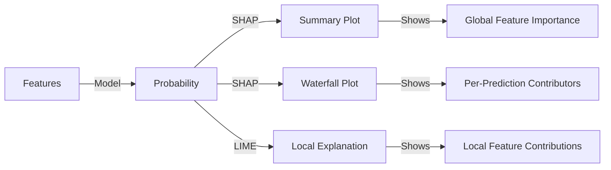

# Predictive Maintenance AI
### Industrial Equipment Failure Prediction & Explainable AI

An end-to-end machine-learning platform for predicting industrial equipment failure risk,
optimizing operational decision thresholds, and explaining model decisions using SHAP and LIME.

---

## 🚀 Live Demo

**[Open Predictive Maintenance AI →](https://predictive-maintenance-of-industrial-equipment.streamlit.app/)**

The live platform includes:
- Dashboard — interactive command center with real-time telemetry and model status
- Manual prediction — adjustable parameter sliders for air temperature, process temperature, RPM, torque, tool wear, and machine type
- Batch CSV inference — bulk predictions with probabilities and risk levels
- Explainability — SHAP waterfall/force plots and LIME bar charts per prediction
- Model evaluation — ROC curve, precision-recall curve, confusion matrices, threshold analysis
- Threshold optimization — F1-maximizing and recall-oriented decision thresholds
- Reporting — downloadable PDF/CSV artifacts with full model metadata

Repository: **[GitHub](https://github.com/ARJUN-0402/Predictive-Maintenance-of-Industrial-Equipment)**

---

## 🧰 Skills & Technologies

### Machine Learning
    

### Explainable AI
 

### Visualization
 

### Application


### Engineering & DevOps
     

## 📋 Skills Summary Table

| Area | Technologies |
| ---- | ------------ |
| Language | Python |
| Data | Pandas, NumPy |
| ML | Scikit-learn, XGBoost |
| Explainability | SHAP, LIME |
| Visualization | Plotly, Matplotlib |
| App | Streamlit |
| Testing | Pytest |
| Code Quality | Ruff, Mypy |
| Deployment | Docker, Streamlit Cloud |
| Version Control | Git, GitHub |

---

## Why this project?

- **Reduces unexpected equipment downtime** — predictive risk scores enable proactive maintenance scheduling
- **Supports maintenance prioritization** — threshold optimization separates operational decisions from probability estimates
- **Converts sensor telemetry into failure risk** — engineered features (temperature_diff, power, wear_rate, torque_normalized, temp_wear_interaction) transform raw sensor data into actionable risk scores
- **Provides interpretable model decisions** — SHAP and LIME explanations help engineers understand model reasoning per prediction
- **Separates probability estimation from operational thresholds** — model output is a probability; the decision threshold determines when a risk score triggers a response

*This project is a benchmark system trained on the AI4I 2020 dataset, not a deployed factory control system.*

---

## ⭐ Project Highlights

- End-to-end predictive maintenance pipeline from raw sensor data to explainable predictions
- Multi-model benchmarking (XGBoost, Random Forest, Gradient Boosting, Logistic Regression)
- XGBoost production inference with domain-derived feature engineering
- SHAP + LIME explainability (global summary plots and local per-prediction explanations)
- Threshold optimization (F1-maximizing and recall-oriented strategies)
- Manual + batch CSV inference with adjustable decision thresholds
- Custom industrial AI UI with reusable component architecture (src/ui_components.py, src/ui_styles.py)
- Automated testing and type checking (162 pytest, flake8, mypy)
- Docker support (python:3.12-slim, docker-compose)
- Streamlit Cloud deployment (live at https://predictive-maintenance-of-industrial-equipment.streamlit.app/)

---

## Application Modules

The application is organized around a navigation registry in `src/ui_components.py`. The sidebar provides single-source-of-truth routing via `st.session_state.page`.

### OVERVIEW

- **Dashboard** — command center view with telemetry, model status, and key metrics

### INTELLIGENCE

- **Predict** — manual slider input or CSV batch upload with adjustable decision threshold
- **Explain** — SHAP waterfall/force plots and LIME bar charts per prediction

### ANALYTICS

- **Dataset** — dataset structure, row count, feature count, class distribution, failure type breakdown
- **EDA** — correlation matrix, numeric distributions, failure type breakdown

### EVALUATION

- **Performance Metrics** — ROC curve, precision-recall curve, confusion matrices, classification metrics
- **Threshold** — threshold optimization analysis, F1 vs recall trade-offs, threshold values

### REPORTING

- **Reports & Downloads** — downloadable artifacts: figures, results, model files, PDF report

### SYSTEM

- **Model Information** — trained model details, feature list, metrics, preprocessing config
- **Model Training** — model training history, parameter tuning results

Navigation flows through `st.session_state.page` with these page IDs: Home, Predict Failure, Explain Prediction, Dataset Overview, EDA, Performance Metrics, Threshold Optimization, Reports & Downloads, Model Information, Model Training.

---

## 🏗️ UI / UX Architecture

The application has a custom UI layer built with reusable components and centralized styling.

**Verified files:** `src/ui_components.py`, `src/ui_styles.py`

Key aspects:

- **Navigation registry** — `NAV_GROUPS` is the single source of truth for page routing; each item is `(sidebar_label, page_id, button_key)`. `navigate_to_page()` updates `st.session_state.page` and triggers a rerender.
- **Centralized HTML rendering** — `render_html()` is the mandated helper for all static UI markup, preventing raw HTML from being rendered as plain text.
- **State-driven page routing** — the single `st.session_state.page` variable dispatches to the correct page render function; unknown page IDs are ignored to prevent corrupted state from routing to non-existent pages.
- **Industrial control-room styling** — `DESIGN` dict in `src/ui_styles.py` defines color palette (`#00d4ff`, `#080b0f`, `#0d1117`, `#e6edf3`), typography, and component styles used throughout.
- **Reusable UI components** — `page_header`, `section_header`, `section_title`, `metric_mega`, `metric_large`, `metric_editorial_row`, `prediction_panel`, `feature_contribution_bars`, `risk_badge`, `risk_scale`, `telemetry_row`, `command_hero`, and `nav_rail_item` encapsulate common patterns and prevent duplication.
- **Prediction card** — `prediction_panel` and `prediction_card` render consistent result cards with probability, label, risk level, threshold, and recommended action.
- **Trusted HTML rendering** — all static markup flows through `render_html()` which uses `st.html()`, ensuring consistent rendering across Streamlit versions.

---

## 🏗️ Architecture Diagram



*Data flow: raw dataset → validation → preprocessing → feature engineering → model training → model registry → evaluation → threshold optimization → inference → explainability (SHAP/LIME) → UI. UI handles prediction, analytics, evaluation, and reporting.*

---

## 📊 Model Results

| Model | Accuracy | Precision | Recall | F1 | ROC-AUC |
| ----- | -------: | --------: | -----: | -: | ------: |
| XGBoost | 0.9840 | 0.7308 | 0.8382 | 0.7808 | 0.9833 |
| Random Forest | 0.9880 | 0.8548 | 0.7794 | 0.8154 | 0.9778 |
| Gradient Boosting | 0.9900 | 0.9138 | 0.7794 | 0.8413 | 0.9754 |
| Logistic Regression | 0.8730 | 0.1921 | 0.8529 | 0.3135 | 0.9384 |

*Metrics computed on held-out test set (20% of AI4I 2020 dataset, 10,000 rows).*

### Model Selection Insight

XGBoost provides the strongest ROC-AUC ranking (0.9833), indicating the best overall separability between failure and normal classes. However, Gradient Boosting delivers the highest F1 score (0.8413) and precision (0.9138), making it preferable when false alarms are costly. Logistic Regression attains the highest recall (0.8529) but at the cost of very low precision (0.1921). Model selection depends on the operational objective and the relative cost of false positives versus false negatives; the project evaluates models across multiple metrics rather than selecting solely on accuracy.

---

## 🎯 Threshold Optimization

Model probability ≠ final operational decision. The project evaluates two threshold strategies:

- **F1-maximizing** — Balances precision and recall for general-purpose deployment. Best F1 threshold is persisted in `models/model_registry.json` under the latest XGBoost version.
- **Recall-oriented** — Prioritizes high recall when missed failures are more costly than false alarms. A recall-constrained threshold (e.g., minimum 80% recall) is also persisted.

**Trade-off curve:**

| Direction | Threshold Change | False Positives | False Negatives | Recall | Precision | F1 |
| --------- | ---------------- | --------------- | --------------- | ------ | --------- | -- |
| More sensitive | Lower threshold | More | Fewer | Higher | Lower | Varies |
| Less sensitive | Higher threshold | Fewer | More | Lower | Higher | Varies |

Threshold values and metrics are stored in the model registry and loaded dynamically by the dashboard. The production threshold is selected based on the operational cost balance between false positives (unnecessary maintenance) and false negatives (missed failures).

---

## 🧠 Explainable AI

### SHAP

Used to understand feature-level contribution to individual predictions. SHAP values are computed using TreeExplainer with `feature_perturbation="tree_path_dependent"`. Provides:

- **Summary plots** — global feature importance across the test set
- **Waterfall plots** — per-prediction contribution breakdown (positive and negative contributors)
- **Force plots** — visual summary of feature push/pull on the prediction
- **Dependence plots** — feature interaction effects

> SHAP describes feature contribution to the model output, not causality between sensor readings and equipment failure.

### LIME

Used for local interpretable explanations. Approximates the model locally with a simple interpretable model to explain individual predictions. Provides bar-chart feature contributions with direction and magnitude.

> LIME provides local feature contributions for individual predictions, not causal relationships.

### Conceptual diagram



---

## 📁 Data Leakage Prevention

Post-failure indicator columns (`TWF`, `HDF`, `PWF`, `OSF`, `RNF`) are excluded from model features. These columns encode failure type information that would only be known after a failure has occurred, constituting target leakage. The `UDI` and `Product ID` columns are also dropped. Only pre-failure sensor readings and machine type are used as model inputs.

The feature column list in `src/config.py` confirms:

```text
FEATURE_COLUMNS = [
    "Air temperature [K]",
    "Process temperature [K]",
    "Rotational speed [rpm]",
    "Torque [Nm]",
    "Tool wear [min]",
    "Type_L", "Type_M", "Type_H",
    "temperature_diff", "power", "wear_rate", "torque_normalized", "temp_wear_interaction",
]
```

Excluded columns: `UDI`, `Product ID`, `TWF`, `HDF`, `PWF`, `OSF`, `RNF`

---

## ⚠️ Limitations

- Uses benchmark AI4I 2020 data rather than live industrial telemetry; generalization to different equipment populations is not guaranteed.
- Performance may not generalize to different equipment populations.
- Operational thresholds should reflect real maintenance costs; metrics are dataset-dependent.
- SHAP and LIME explain model behavior, not causal relationships between sensor readings and equipment failure.
- Class imbalance (96.6% normal / 3.4% failure) may not represent all industrial scenarios.
- Model is trained on static historical data; real-time streaming inference would require additional infrastructure (FastAPI, MQTT, Kafka).
- Real production deployment would require monitoring, data-drift controls, and automated retraining.

---

## 📅 Roadmap

Prioritized enhancements:

1. **Real-time inference API** — Wrap `src/predict.py` in a FastAPI endpoint for SCADA/PLC integration.
2. **Model/data drift monitoring** — Integrate Evidently AI to alert when feature distribution shifts, triggering retraining before performance degrades.
3. **Experiment tracking** — Migrate from `model_registry.json` to MLflow Tracking for full experiment lineage, parameter logging, and model staging.
4. **Automated retraining** — Schedule a periodic retraining pipeline (potentially via Airflow) that evaluates new models against the current champion and promotes if ROC-AUC improves.
5. **Streaming telemetry integration** — Connect to MQTT broker or Apache Kafka topic for live sensor feeds; push predictions to a monitoring dashboard with sub-second latency.

Potential technologies: FastAPI, MLflow, Airflow, MQTT, Kafka — labeled as future work, not current capabilities.

---

## ✅ Quality Gates

Verified current results:

| Check | Status |
|---|---|
| Pytest | ✅ 162 passed |
| Mypy | ✅ Passing |
| Flake8 | ✅ Passing |
| Python compilation | ✅ Passing |

**Commands:**

```bash
python -m pytest tests/ --tb=short
python -m flake8 src/ app/ tests/ --max-line-length=100
python -m mypy src/ --ignore-missing-imports
```

---

## 🔄 CI / Quality Automation

GitHub Actions CI (`.github/workflows/ci.yml`) runs on every push and pull request to `main`:

| Check | Description |
| --- | --- |
| **Lint** | `flake8 src/ app/ tests/ --max-line-length=100` |
| **Type check** | `mypy src/ --ignore-missing-imports` |
| **Test** | `pytest tests/ --tb=short` (162 tests) |

The CI configuration uses Python 3.12. Streamlit Cloud deployment is manual; no automated deployment beyond CI checks is currently configured.

---

## 📦 Installation

```bash
git clone https://github.com/ARJUN-0402/Predictive-Maintenance-of-Industrial-Equipment.git
cd "Predictive Maintenance of Industrial Equipment"

python -m venv .venv

# Windows PowerShell
.venv\Scripts\Activate.ps1

# Linux / macOS
source .venv/bin/activate

pip install -r requirements.txt
```

---

## 🐳 Docker

```bash
docker compose up --build
```

Or build and run manually:

```bash
docker build -t predictive-maintenance .
docker run -p 8501:8501 predictive-maintenance
```

The app will be available at `http://localhost:8501`.

*Dockerfile uses `python:3.12-slim` and runs `streamlit run streamlit_app.py`.*

---

## 🌐 Streamlit Cloud Deployment

Repository: `ARJUN-0402/Predictive-Maintenance-of-Industrial-Equipment`
Branch: `main`
Main file: `streamlit_app.py`

Live URL: <https://predictive-maintenance-of-industrial-equipment.streamlit.app/>

Python version: 3.12 (as specified in `pyproject.toml` `requires-python` and Dockerfile)

---

## 📄 Reports & Artifacts

**Models:** `models/xgboost_model.pkl`, `models/scaler.pkl`, `models/model_registry.json`

**Evaluation figures:** `reports/figures/` — confusion matrices per model, precision-recall curve, threshold analysis, SHAP summary PNG

**Evaluation results:** `reports/results/` — ROC curve (HTML), precision-recall curve (HTML), classification report (txt), model comparison CSV (sorted by ROC-AUC)

**Additional artifacts:** SHAP force plot (HTML), model registry JSON, trained model pickle, scaler pickle, model comparison CSV

**PDF report:** Generated via `src/utils.generate_report()` with configurable sections (model summary, latest metrics, etc.) under `reports/results/`

---


</content>