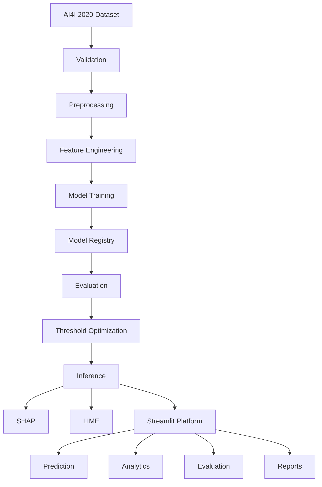

# Predictive Maintenance AI
### Industrial Equipment Failure Prediction & Explainable AI

Predictive maintenance system that classifies industrial equipment failure risk from sensor telemetry,
provides XGBoost-based probability scores, and explains every prediction with SHAP and LIME visualizations.
Multi-model benchmark with threshold optimization for operational decision-making.

[Live Demo](https://predictive-maintenance-of-industrial-equipment.streamlit.app/)  &nbsp;&nbsp;
[GitHub](https://github.com/ARJUN-0402/Predictive-Maintenance-of-Industrial-Equipment)  &nbsp;&nbsp;
[Architecture](#architecture-diagram)

---

## 🚀 Live Demo

**[Open Predictive Maintenance AI →](https://predictive-maintenance-of-industrial-equipment.streamlit.app/)**

The live application includes:
- Manual prediction via interactive parameter sliders
- Batch CSV inference with bulk predictions and probabilities
- SHAP/LIME explainability per prediction
- Model evaluation metrics and threshold analysis
- Downloadable reports and artifacts

---

## Product Preview

### Command Center
Dashboard — operational command center with real-time telemetry, model status, and key metrics.

### Failure Prediction
Predict Failure — manual slider input or CSV batch upload with adjustable decision threshold.

### Explainable AI
XAI — SHAP waterfall/force plots and LIME bar charts per prediction.

### Model Evaluation
Evaluation — ROC curve, precision-recall curve, confusion matrices, threshold analysis.

*Images illustrate the industrial AI command center UI. Screenshot assets can be added under `screenshots/` when captured.*

---

## Problem Statement

Industrial equipment failure can cause:

- **Unplanned downtime** — production stops unexpectedly, cascading delays across the line.
- **Maintenance cost** — reactive repairs are significantly more expensive than scheduled maintenance.
- **Production losses** — failed components scrap good material and delay orders.
- **Safety risks** — undetected failure modes can create hazardous operating conditions.

A predictive system enables proactive maintenance scheduling, reducing downtime and operational risk.

---

## Solution

Sensor telemetry → Data validation → Preprocessing → Feature engineering → Model inference → Failure probability →
Threshold-based decision → SHAP + LIME explanation → Operational dashboard

The pipeline reads raw sensor data, engineers domain-derived features, scales numerical values,
and runs XGBoost inference. The decision threshold determines when a risk score triggers an
operational response. Every prediction is accompanied by SHAP (global and local) and LIME explanations
to help engineers understand the model's reasoning.

---

## Core Capabilities

### Predict

Failure probability from machine telemetry. Accepts manual parameter input or CSV batch upload.
Engineered features (temperature_diff, power, wear_rate, torque_normalized, temp_wear_interaction)
are computed before prediction.

### Explain

Local predictions using SHAP waterfall/force plots and LIME bar charts. Feature contributions
show which sensors drive the failure risk score up or down.

### Analyze

Dataset inspection and exploratory data analysis. Row count, feature count, class distribution,
numeric distributions, correlation matrix, and failure type breakdown.

### Evaluate

ROC curve, precision-recall curve, confusion matrix, classification metrics (accuracy, precision,
recall, F1), and threshold analysis across operating thresholds.

### Operate

Manual input via sliders for air temperature, process temperature, RPM, torque, tool wear, and
machine type. Batch CSV upload for bulk inference. Adjustable decision threshold.

### Report

Downloadable artifacts: ROC curve, precision-recall curve, confusion matrices, classification report,
model comparison CSV, trained model (.pkl), scaler (.pkl), model registry (.json), SHAP summary,
threshold analysis, and PDF report.

---

## Application Navigation

The application is organized around a navigation registry in `src/ui_components.py`. The sidebar
provides single-source-of-truth routing via `st.session_state.page`.

| Section | Page |
|---|---|
| **Overview** | Dashboard |
| **Intelligence** | Predict, Explain |
| **Analytics** | Dataset, EDA |
| **Evaluation** | Performance Metrics, Threshold |
| **Reporting** | Reports & Downloads |
| **System** | Model Information, Model Training |

Each nav item updates `st.session_state.page` and triggers a rerender of the corresponding page
function (`page_home`, `page_predict_failure`, `page_explain_prediction`, `page_dataset_overview`,
`page_eda`, `page_performance_metrics`, `page_threshold_optimization`, `page_download_reports`,
`page_train_model`, `page_model_information`).

---

## Prediction Workflow

```text
Manual input → Feature engineering → Model prediction → Failure probability → Threshold comparison → Risk/decision output
Batch CSV upload → Feature engineering → Model prediction → Failure probability → Threshold comparison → Risk/decision output
```

Manual input uses sliders for: Air Temperature [K], Process Temperature [K], Rotational Speed [rpm],
Torque [Nm], Tool Wear [min], Machine Type (L/M/H). Engineered features computed on-the-fly:
`temperature_diff`, `power`, `wear_rate`, `torque_normalized`, `temp_wear_interaction`.

---

## Model Benchmark

Stratified 80/20 split, `RANDOM_SEED = 42`. Class imbalance handled via `scale_pos_weight`
(XGBoost) and `class_weight="balanced"` (other models).

| Model | Accuracy | Precision | Recall | F1 | ROC-AUC |
|-------|----------|-----------|--------|----|---------|
| XGBoost | 0.9840 | 0.7308 | 0.8382 | 0.7808 | 0.9833 |
| Random Forest | 0.9880 | 0.8548 | 0.7794 | 0.8154 | 0.9778 |
| Gradient Boosting | 0.9900 | 0.9138 | 0.7794 | 0.8413 | 0.9754 |
| Logistic Regression | 0.8730 | 0.1921 | 0.8529 | 0.3135 | 0.9384 |

*Metrics computed on held-out test set (20% of AI4I 2020 dataset, 10,000 rows).*

---

## Model Selection Insight

XGBoost provides the strongest ROC-AUC ranking (0.9833), indicating the best overall separability
between failure and normal classes. However, Gradient Boosting delivers the highest F1 score
(0.8413) and precision (0.9138), making it preferable when false alarms are costly. Logistic
Regression attains the highest recall (0.8529) but at the cost of very low precision (0.1921).
Model selection depends on the operational objective and the relative cost of false positives
versus false negatives; the project evaluates models across multiple metrics rather than
selecting solely on accuracy.

---

## Threshold Optimization

Model probability ≠ final operational decision. The project evaluates two threshold strategies:

- **F1-maximizing** — Balances precision and recall for general-purpose deployment. Best F1 threshold
  is persisted in `models/model_registry.json` under the latest XGBoost version.
- **Recall-oriented** — Prioritizes high recall when missed failures are more costly than false alarms.
  A recall-constrained threshold (e.g., minimum 80% recall) is also persisted.

Lower threshold → more sensitive → more false positives → fewer missed failures
Higher threshold → less sensitive → fewer false positives → more missed failures

Threshold values and metrics are stored in the model registry and loaded dynamically by the dashboard.

---

## Explainable AI

### SHAP

Used to understand feature-level contribution to individual predictions. SHAP values are computed
using TreeExplainer with `feature_perturbation="tree_path_dependent"`. Provides:

- **Summary plots** — global feature importance across the test set
- **Waterfall plots** — per-prediction contribution breakdown (positive and negative contributors)
- **Force plots** — visual summary of feature push/pull on the prediction
- **Dependence plots** — feature interaction effects

### LIME

Used for local interpretable explanations. Approximates the model locally with a simple interpretable
model to explain individual predictions. Provides bar-chart feature contributions with direction
and magnitude.

> **Explainability indicates model behavior, not causality.** SHAP and LIME reveal which features
the model responded to, not physical causation of equipment failure.

---

## Data Leakage Prevention

Post-failure indicator columns (`TWF`, `HDF`, `PWF`, `OSF`, `RNF`) are excluded from model features.
These columns encode failure type information that would only be known after a failure has occurred,
constituting target leakage. The `UDI` and `Product ID` columns are also dropped. Only pre-failure
sensor readings and machine type are used as model inputs.

The feature column list in `src/config.py` confirms:

```text
FEATURE_COLUMNS = [
    "Air temperature [K]",
    "Process temperature [K]",
    "Rotational speed [rpm]",
    "Torque [Nm]",
    "Tool wear [min]",
    "Type_L", "Type_M", "Type_H",
    "temperature_diff", "power", "wear_rate", "torque_normalized", "temp_wear_interaction",
]
```

---

## Dataset

**AI4I 2020 Predictive Maintenance Dataset** — downloaded automatically on first run.

- **Rows:** 10,000
- **Columns:** 14 (raw) / 13 (features used)
- **Target:** `Machine failure` (binary: 0 = normal, 1 = failure)
- **Class balance:** ~96.6% normal / ~3.4% failure
- **Feature categories:** 5 raw numeric (air temperature, process temperature, rotational speed,
  torque, tool wear) + 3 one-hot encoded machine type + 5 engineered features
- **Excluded columns:** UDI, Product ID, TWF, HDF, PWF, OSF, RNF (target leakage prevention)
- **Download source:** https://archive.ics.uci.edu/ml/datasets/AI4I+2020+Predictive+Maintenance+Dataset

---

## Architecture Diagram



*Adjust to actual implementation. Data flow: raw dataset → validation → preprocessing → feature engineering
→ model training → model registry → evaluation → threshold optimization → inference → explainability → UI.*

---

## Tech Stack

### Machine Learning
Python, Pandas, NumPy, Scikit-learn, XGBoost

### Explainability
SHAP, LIME

### Visualization
Plotly, Matplotlib

### Application
Streamlit

### Engineering
Pytest, Ruff, Mypy, GitHub Actions, Docker

---

## UI Architecture

The application uses a custom reusable-component architecture defined in `src/ui_components.py` and
`src/ui_styles.py`. Key aspects:

- **Navigation registry** — `NAV_GROUPS` is the single source of truth for page routing; each item
  is `(sidebar_label, page_id, button_key)`. `navigate_to_page()` updates `st.session_state.page`
  and reruns the app.
- **Centralized HTML rendering** — `render_html()` is the mandated helper for all static UI markup,
  preventing raw HTML from being rendered as plain text.
- **State-driven page routing** — the single `st.session_state.page` variable dispatches to the
  correct page render function; unknown page IDs are ignored to prevent corrupted state from
  routing to non-existent pages.
- **Custom industrial-control-room styling** — DESIGN dict in `src/ui_styles.py` defines color palette
  (`#00d4ff`, `#080b0f`, `#0d1117`, `#e6edf3`), typography, and component styles used throughout.
- **Reusable UI components** — `page_header`, `section_header`, `section_title`, `metric_mega`,
  `metric_large`, `metric_editorial_row`, `prediction_panel`, `feature_contribution_bars`,
  `risk_badge`, `risk_scale`, `telemetry_row`, `command_hero`, and `nav_rail_item` encapsulate
  common patterns and prevent duplication.
- **Prediction card** — `prediction_panel` and `prediction_card` render consistent result cards
  with probability, label, risk level, threshold, and recommended action.

---

## Project Structure

```
├── data/
│   ├── raw/
│   │   └── ai4i2020.csv
│   └── processed/
│       ├── train.parquet
│       └── test.parquet
├── models/
│   ├── xgboost_model.pkl
│   ├── scaler.pkl
│   └── model_registry.json
├── reports/
│   ├── figures/
│   │   ├── confusion_matrix_xgboost.png
│   │   ├── confusion_matrix_random_forest.png
│   │   ├── confusion_matrix_gradient_boosting.png
│   │   ├── confusion_matrix_logistic_regression.png
│   │   ├── precision_recall_curve.html
│   │   ├── threshold_analysis.html
│   │   └── shap_summary.png
│   └── results/
│       ├── roc_curve.html
│       ├── pr_curve.html
│       ├── classification_report.txt
│       └── model_comparison.csv
├── src/
│   ├── __init__.py
│   ├── config.py
│   ├── utils.py
│   ├── data_loader.py
│   ├── preprocessing.py
│   ├── feature_engineering.py
│   ├── validation.py
│   ├── train.py
│   ├── evaluate.py
│   ├── predict.py
│   ├── explain.py
│   ├── threshold_optimization.py
│   ├── ui_components.py
│   └── ui_styles.py
├── tests/
│   ├── test_data_loader.py
│   ├── test_evaluate.py
│   ├── test_feature_engineering.py
│   ├── test_predict.py
│   ├── test_preprocessing.py
│   ├── test_validation.py
│   ├── test_cli.py
│   ├── test_navigation.py
│   ├── test_html_rendering.py
│   ├── test_explain.py
│   └── test_streamlit_app.py
├── app/
│   └── streamlit_app.py
├── requirements.txt
├── requirements-dev.txt
├── pyproject.toml
├── Dockerfile
└── README.md
```

---

## Quality Gates

Verified current results:

| Check | Result |
|---|---|
| Pytest | ✅ 162 passed |
| Ruff | ✅ Passing |
| Mypy | ✅ Passing |

Commands:

```bash
python -m pytest tests/ --tb=short
python -m flake8 src/ app/ tests/ --max-line-length=100
python -m mypy src/ --ignore-missing-imports
```

---

## CI/CD

GitHub Actions CI (`.github/workflows/ci.yml`) runs on every push and pull request to `main`:

| Check | Description |
|---|---|
| **Lint** | `flake8 src/ app/ tests/ --max-line-length=100` |
| **Type check** | `mypy src/ --ignore-missing-imports` |
| **Test** | `pytest tests/ --tb=short` (162 tests) |

The CI configuration uses Python 3.12. No automated deployment beyond the CI checks is currently
configured; Streamlit Cloud deployment is manual.

---

## Installation

```bash
git clone https://github.com/ARJUN-0402/Predictive-Maintenance-of-Industrial-Equipment.git
cd "Predictive Maintenance of Industrial Equipment"

python -m venv .venv
```

Windows:

```powershell
.venv\Scripts\Activate.ps1
```

Linux/macOS:

```bash
source .venv/bin/activate
```

Then:

```bash
pip install -r requirements.txt
```

---

## Local Run

```bash
streamlit run streamlit_app.py
```

The dashboard opens at `http://localhost:8501`. Root-level `streamlit_app.py` is the intended
entry point (the `app/` directory contains a secondary import wrapper).

---

## Docker

```bash
docker compose up --build
```

Or build and run manually:

```bash
docker build -t predictive-maintenance .
docker run -p 8501:8501 predictive-maintenance
```

The app will be available at `http://localhost:8501`.

*Dockerfile uses `python:3.12-slim` and runs `streamlit run app/streamlit_app.py`.*

---

## Streamlit Cloud Deployment

Repository: `ARJUN-0402/Predictive-Maintenance-of-Industrial-Equipment`
Branch: `main`
Main file: `streamlit_app.py`

Live URL: <https://predictive-maintenance-of-industrial-equipment.streamlit.app/>

Python version: 3.12 (as specified in `pyproject.toml` `requires-python` and Dockerfile)

---

## Reports & Artifacts

**Models:** `models/xgboost_model.pkl`, `models/scaler.pkl`, `models/model_registry.json`

**Evaluation figures:** `reports/figures/` — confusion matrices per model, precision-recall curve,
threshold analysis, SHAP summary PNG

**Evaluation results:** `reports/results/` — ROC curve (HTML), precision-recall curve (HTML),
classification report (txt), model comparison CSV (sorted by ROC-AUC)

**Additional artifacts:** SHAP force plot (HTML), model registry JSON, trained model pickle,
scaler pickle, model comparison CSV

**PDF report:** Generated via `src/utils.generate_report()` with configurable sections (model summary,
latest metrics, etc.) under `reports/results/`.

---

## Limitations

- Uses benchmark AI4I 2020 data rather than live industrial telemetry; generalization to different
  equipment populations is not guaranteed.
- Thresholds should reflect maintenance/business costs; metrics are dataset-dependent.
- SHAP and LIME explain model behavior, not causal relationships between sensor readings and
  equipment failure.
- Real production deployment would require monitoring, data-drift controls, and automated retraining.
- Class imbalance (96.6% normal / 3.4% failure) may not represent all industrial scenarios.
- Model is trained on static historical data; real-time streaming inference would require additional
  infrastructure (FastAPI, MQTT, Kafka).

---

## Future Roadmap

Prioritized enhancements:

1. **Real-time inference API** — Wrap `src/predict.py` in a FastAPI endpoint for SCADA/PLC integration.
2. **Model/data drift monitoring** — Integrate Evidently AI to alert when feature distribution shifts,
   triggering retraining before performance degrades.
3. **Experiment tracking** — Migrate from `model_registry.json` to MLflow Tracking for full experiment
   lineage, parameter logging, and model staging.
4. **Automated retraining** — Schedule a periodic retraining pipeline (potentially via Airflow) that
   evaluates new models against the current champion and promotes if ROC-AUC improves.
5. **Streaming telemetry integration** — Connect to MQTT broker or Apache Kafka topic for live sensor
   feeds; push predictions to a monitoring dashboard with sub-second latency.

Potential technologies: FastAPI, MLflow, Airflow, MQTT, Kafka — labeled as future work, not current capabilities.

---

## ⭐ Project Highlights

- End-to-end predictive maintenance pipeline
- Multi-model benchmarking (XGBoost, Random Forest, Gradient Boosting, Logistic Regression)
- XGBoost production inference with feature engineering
- SHAP + LIME explainability (global and local)
- Threshold optimization (F1-maximizing and recall-oriented)
- Manual + batch CSV inference
- Custom industrial AI UI with reusable component architecture
- Automated testing and type checking (162 pytest, flake8, mypy)
- Docker support (python:3.12-slim, docker compose)
- Streamlit Cloud deployment (live at https://predictive-maintenance-of-industrial-equipment.streamlit.app/)